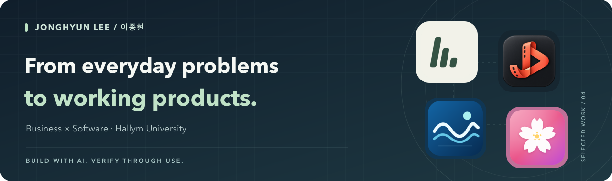
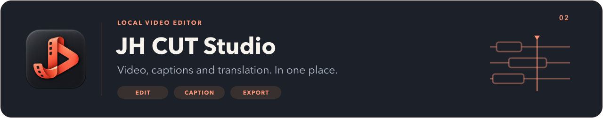
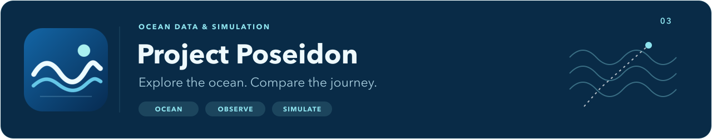
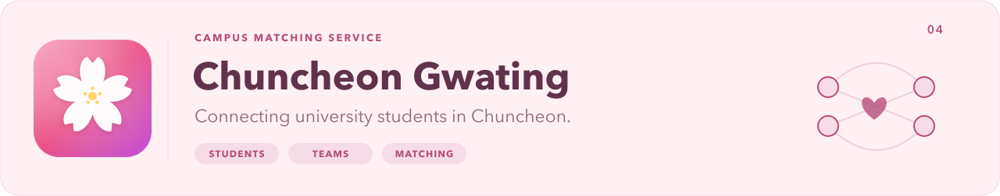

I study Business Administration and Software at Hallym University. My first project recommended outfit colors; since then, I have explored campus services, educational tools, a local AI workspace, and a video editor. I build with AI assistance and improve my work through execution checks and hands-on use.

[king33135867@gmail.com](mailto:king33135867@gmail.com) · [한국어](README.md)

## Now

- Building [AIOS](#aios), a local workspace that connects files on my computer with AI conversations.
- Refining [JH CUT Studio](#jhcut), a macOS video editor with Korean subtitles and translation, in its local development build.
- Running the campus equipment-rental service as Director of Facilities on the Student Welfare Committee.

## Featured projects

A workspace connecting personal reference material and AI conversations with task approval, execution checks, and recovery.

Implementation and verification scope

- Attach reference material and approve individual file changes or commands.
- Check exit codes and file hashes; stop recovery when it conflicts with later edits.
- Real AI and file operations run locally. The public demo uses fictional documents and simulated replies to illustrate the workflow.

`TypeScript` `React` `Fastify` `PostgreSQL` `Ollama`

[Try the workflow](https://aios-demo-mu.vercel.app) · [Source and setup](https://github.com/jonghyun0000/aios) · [Verification records](https://github.com/jonghyun0000/aios/blob/main/docs/43-web-model-selection.md)

A Korean-first editor connecting video editing, captions, translation, and export on a local computer.

Implementation and verification scope

- Timeline editing, automatic captions, and translation between Korean, Japanese, and English.
- Checkpoints and resume support for long tasks, with output quality checks.
- Currently a local development build, with installation instructions and documented verification scope.

`Swift` `macOS` `whisper.cpp`

[Source](https://github.com/jonghyun0000/JHCutStudio) · [Setup](https://github.com/jonghyun0000/JHCutStudio/blob/main/docs/INSTALL-0.7.md) · [Verification status](https://github.com/jonghyun0000/JHCutStudio/blob/main/docs/STATUS.md)

A research project comparing wave and marine wind data with observations and exploring changes across routes and departure conditions.

Implementation and verification scope

- Connects global forecasts, port search, and voyage simulation.
- Records observational comparisons and conditions with insufficient samples separately.
- Still in research and validation; suitability for operational navigation has not been established.

`Python` `FastAPI` `JAX` `MapLibre`

[Source and research](https://github.com/jonghyun0000/project-poseidon) · [Observational validation](https://github.com/jonghyun0000/project-poseidon/blob/main/docs/PHASE24_GLOBAL_OBSERVATIONAL_VALIDATION.md)

A 1:1–4:4 matching web app for university students in Chuncheon. It connects student verification, team registration, matching requests, and administration in one workflow.

Implementation and verification scope

- Student verification, team and member registration, matching requests and acceptance, and administration screens.
- Improvements to atomic team saves, concurrent matching, personal data access, and registration and withdrawal flows.
- Published application, browser, and database verification records, with local tests distinguished from production deployment checks.

`React` `TypeScript` `Supabase` `Vercel`

[Open the service](https://chuncheon-dating5-0.vercel.app/) · [Source](https://github.com/jonghyun0000/chuncheon-dating5.0) · [Verification records](https://github.com/jonghyun0000/chuncheon-dating5.0/blob/main/docs/validation/README.md)

## Services and tools

<table width="100%">
<tr>
<td width="33%" valign="top">
<strong>PromPotion</strong> 
A web MVP for composing, copying, and saving architecture prompts from visual selections. No image generation API is connected.

<a href="https://prompotion.vercel.app"><picture><source media="(prefers-color-scheme: dark)" srcset="assets/profile/btn-try-en-dark.png" /></picture></a>
<a href="https://github.com/jonghyun0000/prompotion"><picture><source media="(prefers-color-scheme: dark)" srcset="assets/profile/btn-source-en-dark.png" /></picture></a>

</td>
<td width="33%" valign="top">
<strong>Hangul Coding Playground</strong> 
An educational web app connecting a Korean-keyword language engine, code editor, and turtle graphics.

<a href="https://korean-coding-platform.vercel.app"><picture><source media="(prefers-color-scheme: dark)" srcset="assets/profile/btn-try-en-dark.png" /></picture></a>
<a href="https://github.com/jonghyun0000/Korean-coding-platform"><picture><source media="(prefers-color-scheme: dark)" srcset="assets/profile/btn-source-en-dark.png" /></picture></a>

</td>
<td width="33%" valign="top">
<strong>Unfollow Lens 2.2</strong> 
A PWA that analyzes Instagram JSON relationships and changes between snapshots in the browser.

<a href="https://re-campus-yngl.vercel.app"><picture><source media="(prefers-color-scheme: dark)" srcset="assets/profile/btn-try-en-dark.png" /></picture></a>
<a href="https://github.com/jonghyun0000/Find-Unfollow2.1"><picture><source media="(prefers-color-scheme: dark)" srcset="assets/profile/btn-source-en-dark.png" /></picture></a>

</td>
</tr>
</table>

## More work

<table width="100%">
<tr>
<td width="50%" valign="top">
<strong>Ttukttak — Outfit Color Matching</strong> 
My first vibe-coding project: representative color extraction and rule-based outfit combinations.

<a href="https://color-matching2-0.vercel.app"><picture><source media="(prefers-color-scheme: dark)" srcset="assets/profile/btn-try-en-dark.png" /></picture></a>
<a href="https://github.com/jonghyun0000/color-matching2.0"><picture><source media="(prefers-color-scheme: dark)" srcset="assets/profile/btn-source-en-dark.png" /></picture></a>

</td>
<td width="50%" valign="top">
<strong>Tuition Receipt</strong> 
Explore and compare university financial disclosures with data provenance.

<a href="https://university-tuition-fees.vercel.app"><picture><source media="(prefers-color-scheme: dark)" srcset="assets/profile/btn-try-en-dark.png" /></picture></a>
<a href="https://github.com/jonghyun0000/University-tuition-fees"><picture><source media="(prefers-color-scheme: dark)" srcset="assets/profile/btn-source-en-dark.png" /></picture></a>

</td>
</tr>
<tr>
<td width="50%" valign="top">
<strong>Lotto 6/45 Statistics</strong> 
Draw statistics and tests of number-selection assumptions. This is not a winning-number prediction service.

<a href="https://lotto-645-stats.vercel.app"><picture><source media="(prefers-color-scheme: dark)" srcset="assets/profile/btn-try-en-dark.png" /></picture></a>
<a href="https://github.com/jonghyun0000/lotto-645-stats"><picture><source media="(prefers-color-scheme: dark)" srcset="assets/profile/btn-source-en-dark.png" /></picture></a>

</td>
<td width="50%" valign="top">
<strong>ABBA</strong> 
Goal-based financial plan calculations and AI explanations. Account connections are UI mockups; run this project locally.

<a href="https://github.com/jonghyun0000/abba-finance-hackathon#시작하기"><picture><source media="(prefers-color-scheme: dark)" srcset="assets/profile/btn-setup-en-dark.png" /></picture></a>
<a href="https://github.com/jonghyun0000/abba-finance-hackathon"><picture><source media="(prefers-color-scheme: dark)" srcset="assets/profile/btn-source-en-dark.png" /></picture></a>

</td>
</tr>
<tr>
<td width="50%" valign="top">
<strong>Re:Campus</strong> 
A browser-storage marketplace demo with illustrative environmental metrics.

<a href="https://re-campus.vercel.app"><picture><source media="(prefers-color-scheme: dark)" srcset="assets/profile/btn-try-en-dark.png" /></picture></a>
<a href="https://github.com/jonghyun0000/Re-Campus1.0"><picture><source media="(prefers-color-scheme: dark)" srcset="assets/profile/btn-source-en-dark.png" /></picture></a>

</td>
<td width="50%" valign="top">
<strong>School Uniform Kiosk</strong> 
Customer and administration screens for uniform orders, alterations, exchanges, and reservations.

<a href="https://smart-school-uniform-app2-0-iw2y.vercel.app/customer"><picture><source media="(prefers-color-scheme: dark)" srcset="assets/profile/btn-try-en-dark.png" /></picture></a>
<a href="https://github.com/jonghyun0000/smart-School-uniform3.0"><picture><source media="(prefers-color-scheme: dark)" srcset="assets/profile/btn-source-en-dark.png" /></picture></a>

</td>
</tr>
<tr>
<td width="50%" valign="top">
<strong>Hand Tracking and Gesture Classification</strong> 
An experiment in webcam hand tracking and rule-based classification, with explicit uncertainty in handshape mappings.

<a href="https://sign-language1-0-jsqy.vercel.app/"><picture><source media="(prefers-color-scheme: dark)" srcset="assets/profile/btn-try-en-dark.png" /></picture></a>
<a href="https://github.com/jonghyun0000/Sign-language1.0"><picture><source media="(prefers-color-scheme: dark)" srcset="assets/profile/btn-source-en-dark.png" /></picture></a>

</td>
<td width="50%" valign="top">
<strong>US Stock Trading Bot</strong> 
Order, fill, and accounting consistency; documented defects and improvements. Local simulation setup is available.

<a href="https://github.com/jonghyun0000/Toss-US-Auto-Trading-Bot#실행"><picture><source media="(prefers-color-scheme: dark)" srcset="assets/profile/btn-setup-en-dark.png" /></picture></a>
<a href="https://github.com/jonghyun0000/Toss-US-Auto-Trading-Bot"><picture><source media="(prefers-color-scheme: dark)" srcset="assets/profile/btn-source-en-dark.png" /></picture></a>

</td>
</tr>
</table>

## Technologies used in these projects

- **Web:** TypeScript · React · Next.js
- **Backend and data:** Fastify · Python · FastAPI · PostgreSQL · Supabase
- **Local AI and apps:** Ollama · Swift · whisper.cpp
- **Execution and verification:** Docker · GitHub Actions · unit and browser tests

## Beyond code

I use business studies to think about why a service is needed, and software to explore how it can work.

- Business Administration student, double major in Computer Engineering track, Hallym University (Mar 2023–)
- Director of Facilities, Student Welfare Committee; campus equipment-rental operations (Mar 2026–)

Other experience and learning

- Republic of Korea Marine Corps; completed service as Sergeant (Feb 2024–Aug 2025)
- Studying for SQLD and Social Research Analyst Level 2
- Qualifications: Korean Class 1 driver's license; ski instructor LEVEL 1 and TEACHING 1; Taekwondo 2nd Dan

