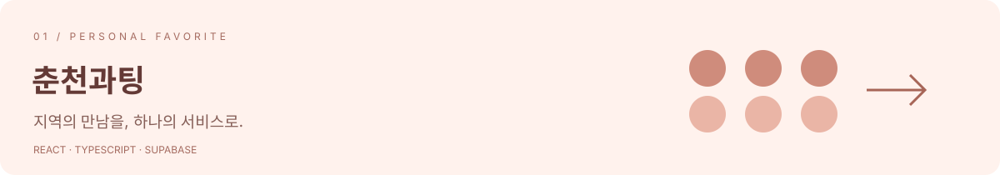
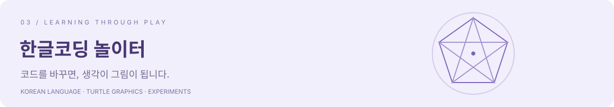

한림대학교에서 경영학과 소프트웨어를 공부하는 **이종현**입니다. 생활에서 발견한 문제를 웹으로 만들고 있습니다. 첫 바이브코딩이었던 옷 색 매칭에서 시작해, 지역 대학생 서비스와 교육 도구로 관심을 넓혔습니다.

AI와 함께 구현하고, 만든 것을 이해하고 검증하며 개선하는 과정도 이곳에 기록합니다.

## Selected work

### 춘천과팅

**춘천 지역 대학생을 위한 3:3 매칭 서비스.** 가장 애착을 갖고 발전시켜 온 프로젝트입니다. 학생 인증부터 팀 등록, 매칭 요청, 관리자 화면까지 하나의 흐름으로 연결했습니다.

`React` `TypeScript` `Supabase` `Vercel`

**[서비스 열기 ↗](https://chuncheon-dating5-0.vercel.app/)** · [저장소](https://github.com/jonghyun0000/chuncheon-dating5.0)

### 뚝딱 — 컬러매칭

**“이 옷에 무슨 색을 입지?”에서 시작한 첫 바이브코딩.** 옷 사진에서 대표 색을 추출하고, 상황에 맞는 색 조합을 추천합니다. 사진 없이 색을 눌러 바로 체험할 수도 있습니다.

- **만든 것:** K-means 색 추출, 색 조합 추천과 이유, 상황별 모드, 즐겨찾기.
- **개선한 것:** 단색 사진 분석 오류 수정, 같은 입력의 결과 재현, 업로드 오류 안내와 키보드 포커스.
- **확인할 수 있는 근거:** 색 추출 경계 사례와 등록 색 전체의 추천 제약을 확인하는 자동 테스트. 추천 점수는 취향이나 정확도 확률이 아닌 규칙 기반 참고값입니다.

`React` `TypeScript` `Vite` `Color analysis`

**[직접 체험하기 ↗](https://color-matching2-0.vercel.app)** · [저장소](https://github.com/jonghyun0000/color-matching2.0) · [테스트](https://github.com/jonghyun0000/color-matching2.0/blob/main/scripts/color.test.ts) · [개선 기록](https://github.com/jonghyun0000/color-matching2.0/blob/main/docs/UPGRADE.md)

### 한글코딩 놀이터

**코딩을 처음 배우는 사람이, 아는 말로 시작할 수 있도록.** 한글 코드와 거북이 그래픽을 연결한 교육용 웹앱입니다. 언어 처리와 학습 경험을 더 이해하며 발전시키고 있는 프로젝트입니다.

- **만든 것:** 한글 언어 엔진, CodeMirror 편집기, 12차시 미션과 학습 진도 저장.
- **개선한 것:** 변의 수와 누적 합을 바꿔보는 예제 실험실. 먼저 예상하고, 설명을 보고, 코드로 실행하는 흐름을 추가했습니다.
- **확인할 수 있는 근거:** 기존 문법·미션 스모크 테스트 150개와 새 실험 예제 테스트 16개. 코드 교체·페이지 이동 시 저장 처리도 보완했습니다.

`TypeScript` `React` `CodeMirror` `Canvas`

**[놀이터 열기 ↗](https://korean-coding-platform.vercel.app)** · [저장소](https://github.com/jonghyun0000/Korean-coding-platform) · [테스트](https://github.com/jonghyun0000/Korean-coding-platform/tree/main/scripts) · [개선 기록](https://github.com/jonghyun0000/Korean-coding-platform/blob/main/docs/UPGRADE.md)

## Also built

| 프로젝트 | 다룬 문제 |
| :--- | :--- |
| [대학 등록금 비교](https://github.com/jonghyun0000/University-tuition-fees) | 공공데이터를 대학별로 조회하고 비교하기 |
| [수어 인식기](https://github.com/jonghyun0000/Sign-language1.0) | 웹캠 손 추적과 제스처 분류 |
| [로또 통계](https://github.com/jonghyun0000/lotto-645-stats) | 역대 회차 통계와 예측 가능성 검정 |
| [스마트 교복 키오스크](https://github.com/jonghyun0000/smart-School-uniform3.0) | 매장의 주문·수선·교환·예약 흐름 |
| [Find-Unfollow](https://github.com/jonghyun0000/Find-Unfollow2.1) | 브라우저 안에서 인스타그램 데이터 분석 |
| [미국주식 자동매매](https://github.com/jonghyun0000/Toss-US-Auto-Trading-Bot) | Python 자동화와 결함 감사 기록 |
| [Re-Campus](https://github.com/jonghyun0000/Re-Campus1.0) | 캠퍼스 중고거래와 탄소 절감량 환산 |

## Tools I work with

## Beyond code

경영학의 관점으로 서비스의 필요성을 생각하고, 소프트웨어로 작게 구현해 봅니다.

- **한림대학교** 경영학과 · 컴퓨터공학계열 복수전공 (2023.03–)
- **학생복지위원회 시설국 부장** · 교내 물품대여 서비스 운영 (2026.03–)
- **대한민국 해병대** 병장 만기전역 (2024.02–2025.08)

학습 중인 분야 · 기타 자격

학습·시험 준비: SQLD, 사회조사분석사 2급

취득 자격: 운전면허 1종 보통 · 스키지도자 LEVEL 1 · 스키지도요원 TEACHING 1 · 태권도 2단

---

<b>작은 문제에서 시작해, 더 나은 결과물로.</b> <a href="mailto:king33135867@gmail.com">king33135867@gmail.com</a>

