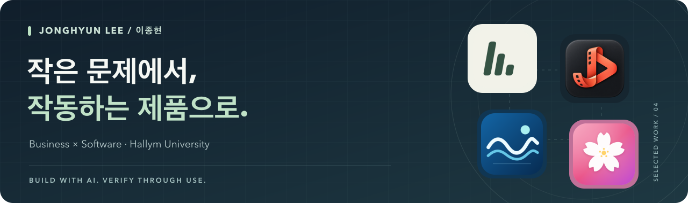
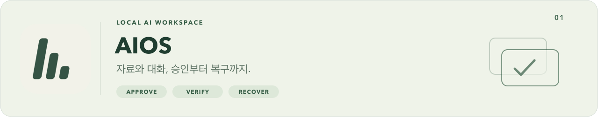
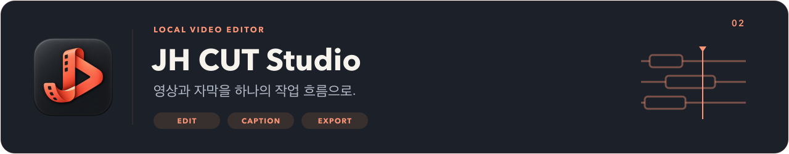
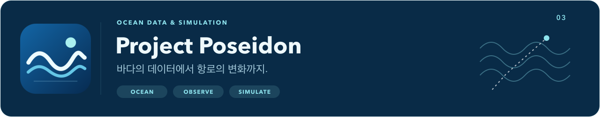
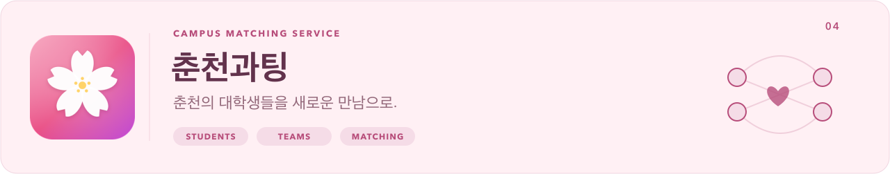

한림대학교에서 경영학과 소프트웨어를 공부합니다. 옷 색 조합을 추천하는 첫 프로젝트에서 시작해, 지역 대학생 서비스와 교육 도구, 로컬 AI 작업공간과 영상 편집기로 관심을 넓혀 왔습니다. AI와 함께 구현하고, 실행 결과와 사용 경험을 바탕으로 개선합니다.

[Email](mailto:king33135867@gmail.com) · [English](README.en.md)

## 대표 프로젝트

내 컴퓨터의 자료와 AI 대화를 연결하고, 실제 작업의 승인·검증·복구까지 이어지는 환경을 만들고 있습니다.

구현 내용과 검증 범위

- 자료를 연결해 대화하고, 파일 변경·명령 실행을 건별로 승인합니다.
- 종료 코드와 파일 해시로 실행 결과를 확인하고, 이후 수정과 충돌하는 복구는 멈춥니다.
- 실제 AI·파일 작업은 로컬에서 실행합니다. 공개 체험판은 가상 문서와 모의 응답으로 작업 흐름을 보여줍니다.

`TypeScript` `React` `Fastify` `PostgreSQL` `Ollama`

[흐름 체험하기](https://aios-demo-mu.vercel.app) · [소스·실행 안내](https://github.com/jonghyun0000/aios) · [검증 기록](https://github.com/jonghyun0000/aios/blob/main/docs/43-web-model-selection.md)

영상 편집부터 자막·번역·출력까지, 한국어로 작업할 수 있는 로컬 편집기를 만들고 있습니다.

구현 내용과 검증 범위

- 타임라인 편집, 자동 자막, 한국어·일본어·영어 번역을 연결합니다.
- 긴 작업의 체크포인트·이어하기와 출력 품질 검사를 제공합니다.
- 현재는 로컬 개발 빌드입니다. 설치 안내와 실제 검증 범위를 함께 공개합니다.

`Swift` `macOS` `whisper.cpp`

[소스](https://github.com/jonghyun0000/JHCutStudio) · [설치 안내](https://github.com/jonghyun0000/JHCutStudio/blob/main/docs/INSTALL-0.7.md) · [검증 상태](https://github.com/jonghyun0000/JHCutStudio/blob/main/docs/STATUS.md)

해양 파랑·해상풍 데이터를 관측과 대조하고, 항로와 출항 조건에 따른 변화를 살펴보는 연구 프로젝트입니다.

구현 내용과 검증 범위

- 전 지구 예보 데이터와 항만 검색, 항로 시뮬레이션을 연결합니다.
- 관측 대조 결과와 표본이 부족한 조건을 구분해 기록합니다.
- 연구·검증 단계이며, 현업 항해에 투입할 수 있는 수준은 아직 확인하지 못했습니다.

`Python` `FastAPI` `JAX` `MapLibre`

[소스·연구 기록](https://github.com/jonghyun0000/project-poseidon) · [관측 대조](https://github.com/jonghyun0000/project-poseidon/blob/main/docs/PHASE24_GLOBAL_OBSERVATIONAL_VALIDATION.md)

강원대·한림대·성심대·춘교대 학생을 위한 1:1~4:4 매칭 웹앱입니다. 지역 대학생의 만남을 학생 인증부터 팀 등록, 매칭 요청과 관리까지 하나의 흐름으로 연결했습니다.

구현 내용과 검증 범위

- 학생 인증, 팀·팀원 등록, 매칭 신청·수락과 관리자 화면을 제공합니다.
- 팀 저장의 원자성, 매칭 동시성, 개인정보 접근 권한과 가입·탈퇴 흐름을 개선했습니다.
- 애플리케이션·브라우저·DB 검증 기록을 공개하고, 로컬 시험과 운영 배포 확인을 구분합니다.

`React` `TypeScript` `Supabase` `Vercel`

[서비스 열기](https://chuncheon-dating5-0.vercel.app/) · [소스](https://github.com/jonghyun0000/chuncheon-dating5.0) · [검증 기록](https://github.com/jonghyun0000/chuncheon-dating5.0/blob/main/docs/validation/README.md)

## 서비스와 도구

<table width="100%">
<tr>
<td width="33%" valign="top">
<strong>PromPotion</strong> 
건축 이미지의 시각 요소를 골라 프롬프트를 작성·복사·저장하는 웹 MVP. 이미지 생성 API는 연결하지 않았습니다.

<a href="https://prompotion.vercel.app"><picture><source media="(prefers-color-scheme: dark)" srcset="assets/profile/btn-try-ko-dark.png" /></picture></a>
<a href="https://github.com/jonghyun0000/prompotion"><picture><source media="(prefers-color-scheme: dark)" srcset="assets/profile/btn-source-ko-dark.png" /></picture></a>

</td>
<td width="33%" valign="top">
<strong>한글코딩 놀이터</strong> 
한글 키워드 언어 엔진, 코드 편집기와 거북이 그래픽을 연결한 교육용 웹앱.

<a href="https://korean-coding-platform.vercel.app"><picture><source media="(prefers-color-scheme: dark)" srcset="assets/profile/btn-try-ko-dark.png" /></picture></a>
<a href="https://github.com/jonghyun0000/Korean-coding-platform"><picture><source media="(prefers-color-scheme: dark)" srcset="assets/profile/btn-source-ko-dark.png" /></picture></a>

</td>
<td width="33%" valign="top">
<strong>Unfollow Lens 2.2</strong> 
Instagram JSON 파일의 팔로우 관계와 기준일별 변화를 브라우저에서 분석하는 PWA.

<a href="https://re-campus-yngl.vercel.app"><picture><source media="(prefers-color-scheme: dark)" srcset="assets/profile/btn-try-ko-dark.png" /></picture></a>
<a href="https://github.com/jonghyun0000/Find-Unfollow2.1"><picture><source media="(prefers-color-scheme: dark)" srcset="assets/profile/btn-source-ko-dark.png" /></picture></a>

</td>
</tr>
</table>

## 더 만든 것

<table width="100%">
<tr>
<td width="50%" valign="top">
<strong>뚝딱 — 컬러매칭</strong> 
첫 바이브코딩 프로젝트. 옷 사진의 대표 색 추출과 규칙 기반 조합 추천.

<a href="https://color-matching2-0.vercel.app"><picture><source media="(prefers-color-scheme: dark)" srcset="assets/profile/btn-try-ko-dark.png" /></picture></a>
<a href="https://github.com/jonghyun0000/color-matching2.0"><picture><source media="(prefers-color-scheme: dark)" srcset="assets/profile/btn-source-ko-dark.png" /></picture></a>

</td>
<td width="50%" valign="top">
<strong>등록금 영수증</strong> 
대학 공시 재정 데이터의 조회·비교와 출처 안내.

<a href="https://university-tuition-fees.vercel.app"><picture><source media="(prefers-color-scheme: dark)" srcset="assets/profile/btn-try-ko-dark.png" /></picture></a>
<a href="https://github.com/jonghyun0000/University-tuition-fees"><picture><source media="(prefers-color-scheme: dark)" srcset="assets/profile/btn-source-ko-dark.png" /></picture></a>

</td>
</tr>
<tr>
<td width="50%" valign="top">
<strong>로또 통계 6/45</strong> 
회차별 통계와 추첨 모델의 가정 검정. 당첨 예측 서비스가 아닙니다.

<a href="https://lotto-645-stats.vercel.app"><picture><source media="(prefers-color-scheme: dark)" srcset="assets/profile/btn-try-ko-dark.png" /></picture></a>
<a href="https://github.com/jonghyun0000/lotto-645-stats"><picture><source media="(prefers-color-scheme: dark)" srcset="assets/profile/btn-source-ko-dark.png" /></picture></a>

</td>
<td width="50%" valign="top">
<strong>ABBA</strong> 
목표 기반 금융 계획 계산과 AI 설명. 계좌 연동은 UI 시안이며, 로컬에서 실행합니다.

<a href="https://github.com/jonghyun0000/abba-finance-hackathon#시작하기"><picture><source media="(prefers-color-scheme: dark)" srcset="assets/profile/btn-setup-ko-dark.png" /></picture></a>
<a href="https://github.com/jonghyun0000/abba-finance-hackathon"><picture><source media="(prefers-color-scheme: dark)" srcset="assets/profile/btn-source-ko-dark.png" /></picture></a>

</td>
</tr>
<tr>
<td width="50%" valign="top">
<strong>Re:Campus</strong> 
브라우저 저장 기반 중고거래 데모와 예시 환경 지표.

<a href="https://re-campus.vercel.app"><picture><source media="(prefers-color-scheme: dark)" srcset="assets/profile/btn-try-ko-dark.png" /></picture></a>
<a href="https://github.com/jonghyun0000/Re-Campus1.0"><picture><source media="(prefers-color-scheme: dark)" srcset="assets/profile/btn-source-ko-dark.png" /></picture></a>

</td>
<td width="50%" valign="top">
<strong>스마트 교복 키오스크</strong> 
교복 주문·수선·교환·예약을 위한 고객용 화면과 관리자 화면.

<a href="https://smart-school-uniform-app2-0-iw2y.vercel.app/customer"><picture><source media="(prefers-color-scheme: dark)" srcset="assets/profile/btn-try-ko-dark.png" /></picture></a>
<a href="https://github.com/jonghyun0000/smart-School-uniform3.0"><picture><source media="(prefers-color-scheme: dark)" srcset="assets/profile/btn-source-ko-dark.png" /></picture></a>

</td>
</tr>
<tr>
<td width="50%" valign="top">
<strong>손 추적·제스처 분류</strong> 
웹캠 손 추적과 규칙 분류 실험. 수형 대응의 근거·불확실성을 표시합니다.

<a href="https://sign-language1-0-jsqy.vercel.app/"><picture><source media="(prefers-color-scheme: dark)" srcset="assets/profile/btn-try-ko-dark.png" /></picture></a>
<a href="https://github.com/jonghyun0000/Sign-language1.0"><picture><source media="(prefers-color-scheme: dark)" srcset="assets/profile/btn-source-ko-dark.png" /></picture></a>

</td>
<td width="50%" valign="top">
<strong>미국주식 자동매매 봇</strong> 
주문·체결·손익 정합성과 결함 감사·개선 기록. 로컬 모의 실행 안내를 제공합니다.

<a href="https://github.com/jonghyun0000/Toss-US-Auto-Trading-Bot#실행"><picture><source media="(prefers-color-scheme: dark)" srcset="assets/profile/btn-setup-ko-dark.png" /></picture></a>
<a href="https://github.com/jonghyun0000/Toss-US-Auto-Trading-Bot"><picture><source media="(prefers-color-scheme: dark)" srcset="assets/profile/btn-source-ko-dark.png" /></picture></a>

</td>
</tr>
</table>

## 프로젝트에서 사용하는 기술

- **웹:** TypeScript · React · Next.js
- **서버·데이터:** Fastify · Python · FastAPI · PostgreSQL · Supabase
- **로컬 AI·앱:** Ollama · Swift · whisper.cpp
- **실행·검증:** Docker · GitHub Actions · 단위·브라우저 테스트

## 개발 밖에서

경영학의 관점으로 서비스의 필요성을 생각하고, 소프트웨어로 구현해 봅니다.

- 한림대학교 경영학과 · 컴퓨터공학계열 복수전공 (2023.03–)
- 학생복지위원회 시설국 부장 · 교내 물품대여 서비스 운영 (2026.03–)

그 밖의 경험과 학습

- 대한민국 해병대 병장 만기전역 (2024.02–2025.08)
- 학습·시험 준비: SQLD, 사회조사분석사 2급
- 취득 자격: 운전면허 1종 보통 · 스키지도자 LEVEL 1 · 스키지도요원 TEACHING 1 · 태권도 2단

---

[이메일로 연락하기](mailto:king33135867@gmail.com)
